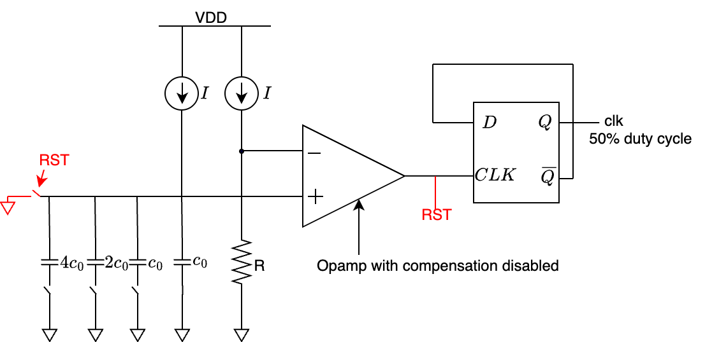
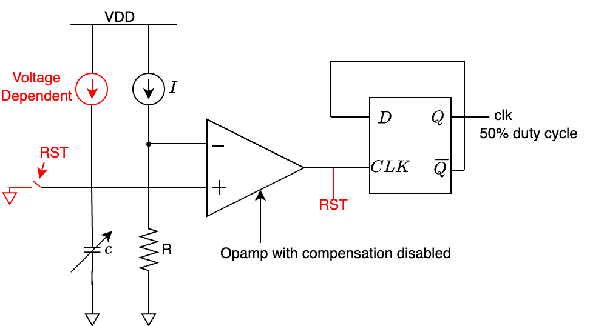
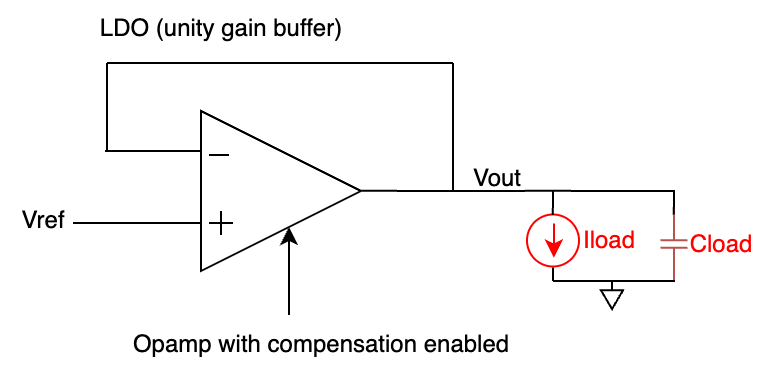
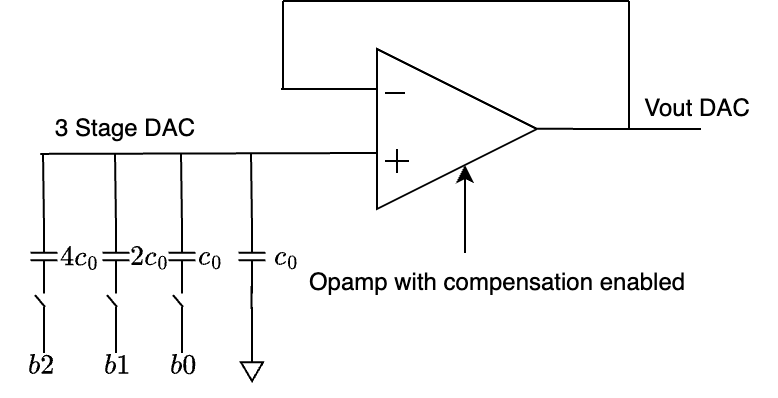

# DAC to the Future: Multi-Mode Educational Analog Chip Proposal for IEEE SSCS Chipathon 2025 MOSbius Track
This is our chip proposal (DACFUTURE-EDU) for the SSCS PICO Design Contest (Chipathon 2025) in the MOSbius track. The chip extends the original MOSbius concept to focus on power management circuits, enabling educational experiments in advanced analog IC design.

## Datasheet

### Functionality of Your Chip & Target Specs
DACFUTURE-EDU is a chip inspired by the original MOSbius, optimized for power management and analog circuit experiments in advanced IC design courses. It allows users to configure and test CMOS transistors in power-related topologies (e.g., LDOs, BGRs) via a programmable switch matrix, enabling rapid prototyping without full tapeouts.
- **Core Functionality**: Reconfigurable 2-stage OTA as the central building block, combinable with peripherals for experiments like MOS characteristics, single-stage amplifiers, compensated OTAs, BGRs, LDOs, and oscillators.
- **Added Features**:
  - 4-bit DAC for programmable voltage references or switching (e.g., in LDO feedback or BGR trimming).
  - Programmable VCO (voltage-controlled oscillator).
  - Programmable RC oscillator for clock generation.
  - Integration of BGR (bandgap reference) and LDO (low-dropout regulator) blocks, configurable with the OTA for stability/compensation experiments.
    
- **Target Specs** (based on GF180MCU process, aligned with MOSbius):
### Chip Overview
**Name**: DACFUTURE-EDU  
**Technology**: GF180MCU (180nm CMOS)  
**Package**: 68-pin PLCC  
**Core Supply**: 3.3V  
**Die Area**: ~4mm²  

### Operating Modes (Controlled by M0/M1 pins)
- **Mode 00**: Programmable RC Fixed Frequency Oscillator 
- **Mode 01**: Voltage Controlled Oscillator 
- **Mode 10**: Low Dropout Regulator 
- **Mode 11**: 4-bit DAC
  
#### Core OTA Block
- DC Gain: 
- Unity Gain Bandwidth: 
- Phase Margin: 
- Power Consumption: 
- Input Offset: 
- CMRR: 
- PSRR: 

#### Mode-Specific Performance
**RC Oscillator Mode:**
- Frequency Range: 

**VCO Mode:**

**LDO Mode:**

**DAC Mode:**
- Resolution: 4-bit
- Output Range: 0-3V

### Additional Building Blocks
- **Bandgap Reference**: 
- **Constant-gm Reference**: 
- **On-chip Test Structures**:
- 
### Block Diagram
[Work in Progress]

## Functionality of Building Blocks
- **2-Stage OTA (Core)**: Amplifies differential signals; configurable gain/bandwidth; supports Miller compensation for stability experiments.
- **4-Bit DAC**: Generates programmable voltages (e.g., for LDO setpoint or BGR trimming); used in switching experiments.
- **Programmable VCO**: Voltage-tunable ring oscillator.
- **Programmable RC Oscillator**: RC-based relaxation oscillator.
- **BGR (Bandgap Reference)**: Provides stable voltage reference; combinable with OTA.
- **LDO (Low-Dropout Regulator)**: Regulates output voltage; uses OTA in error amp; experiments on dropout, load regulation.

These enable modular experiments, e.g., combining OTA + BGR + LDO for a full power supply circuit.

## 3. Pin-Out Description and Multiplexing Strategy
[Work in Progress]

## 4. Application Diagrams
Different modes of operation:

### Mode 00: Programmable RC Fixed Frequency Oscillator

### Mode 01: Voltage control oscillator

### Mode 10: LDO

### Mode 11: 3-bit DAC

## 5. Testing Methodology
### DC Characterization
### AC Characterization
### Mode-Specific Tests
### Educational Experiments

## 6. Team Member Roles
Kevin Kong 
Amir Mohammad Fathalian
Jimena Martinez Cano
Jatin 
Andrea Sannino

## 7. Week-by-Week Schedule
Aligned with Chipathon blocks
Week 28-33
Schematics and Simulation
Week 34-39
Layout and Verification

## Educational Impact
This multi-mode chip provides comprehensive analog design education through:
1. **Fundamental concepts**: MOS physics, amplifier design, feedback systems
2. **Advanced topics**: Compensation techniques, precision references, power management
3. **System integration**: Mode switching, resource sharing, test methodology
4. **Practical skills**: Layout, verification, measurement techniques

The design enables progressive learning from basic transistor characterization to complex system-level experiments, making it ideal for the MOSbius educational mission of bridging theory and practice in analog IC design.
